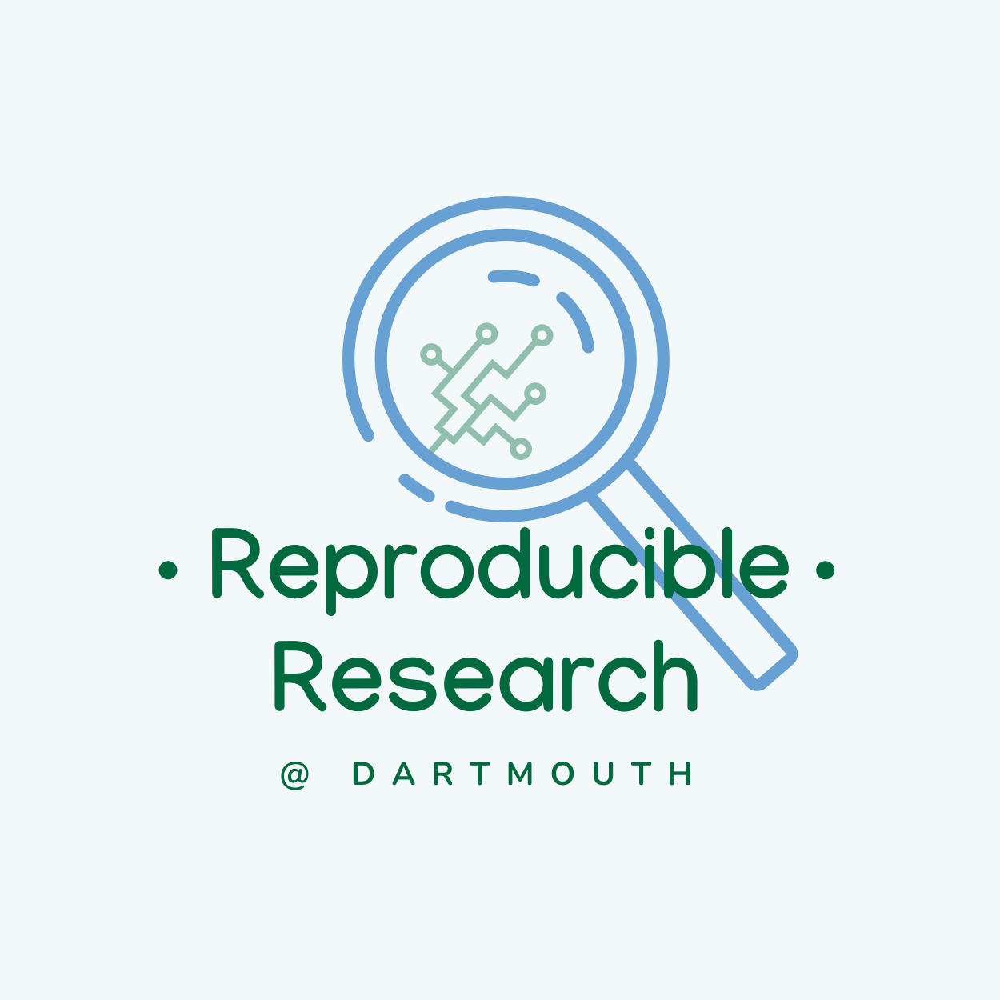

# Reproducible Research 



Reproducible Research materials, provided by the Dartmouth Library and Dartmouth ITC.


## How to use this repository
This repository contains materials used in the workshops offered by Dartmouth's Reproducible Research group. You are free to download or fork it and use the materials provided according to the licensing terms.

Furthermore, this repository is integrated into [Dartmouth's JupyterHub](https://jhub.dartmouth.edu). You can access the materials and run any contained Jupyter Notebooks directly by going to [JupyterHub](https://jhub.dartmouth.edu), starting a server and choosing ``Reproducible Research Workshops`` as your server option.


## How to contribute

The materials for a specific workshop are included as a [submodule](https://github.blog/2016-02-01-working-with-submodules/). This keeps the change history of each individual workshop separate from the history of the repo as a whole.

If you would like your materials added, they need to live in a git repository (e.g. on [git.dartmouth.edu](https://git.dartmouth.edu)). To include them, you can either send a message to [Simon](mailto:simon.stone@dartmouth.edu?subject=New%20RR%20workshop) with a link to the repository or you can add it yourself:

1. Clone this repository (or fork it first).
2. Add your workshop as a submodule by running the following command from this repo's root directory:
```
git submodule add <your-repo-clone-link> <path-within-this-repo>
```
Example:
Let's say you want to add a new workshop called `My Data Science Workshop` to this repo's subfolder `data-science`. Let's also say your clone link is `git@git.dartmouth.edu:my-data-science-workshop.git`. The command to add it would therefore be:
```
git submodule add git@git.dartmouth.edu:my-data-science-workshop.git data-science/my-data-science-workshop
```
3. Commit and push the change.
4. Open a merge request (only if you are working on a fork).

---
**NOTE**

When you update your materials in your own repo, the changes will not automagically propagate to this repository. **The link in here points to a particular state of your repo, frozen in time!** This is by design so you are free to work with your repo without affecting the public-facing materials in this one. 

---
If you want to release an updated version of your materials, we have to update the submodule.

You once again have two options: [Contact Simon](mailto:simon.stone@dartmouth.edu?subject=Update%20RR%20workshop) or do it yourself:

1. From the repo root:
```
git submodule update --remote --merge <path-to-your-submodule>
```
2. Commit and push the change.
3. Open a merge request.
