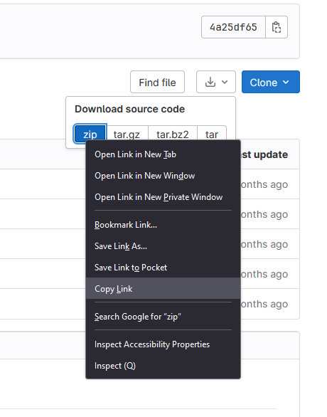

# Gitlab/Hub to Google Colab Integration

+ Would you like to adapt a Jupyter Notebook so that you can share it with others on Google Colab?
+ Would you like to pull data from Gitlab, GitHub, or Dropbox for use with your Colab notebook?
+ Are you teaching using our JupyterHub platform (jhub.dartmouth.edu), but would like to create a backup option?

If you answer yes to any of these questions, you are in the right place.

## Opening your Jupyter Notebook in Colab

1. Upload your Jupyter Notebook to a Google Drive folder of your choosing.
2. Open the notebook from within your Google Drive folder. It will be automatically opened in Colab.
3. Try running your cell(s) that import Python libraries / packages to see if there are any libraries not already installed in Colab.
    a. If the running of these import commands raises any errors, you can insert a cell above the import cell to install the missing packages, for example:
        
        !pip install nltk

## Importing Data into Colab

The remainder of this guide will outline three principle ways you and your students / collaborators can import data into a Colab notebook.

## Option 1: Importing Data from Github/lab into Colab

1. First, go to the repo in GitHub/Lab that has your data. 
    + Select the down arrow next to the download icon.
    + Right-click or Command-Click on the zip button and select copy link
    
2. 	Insert a cell in your notebook that gets and unzips the data from your GitHub/Lab account.
	+ ! wget [paste copied link here]
	+ ! unzip [insert just the name (not the full path) of the zipped file]
	+ Example:
    ```
    ! wget https://git.dartmouth.edu/lib-digital-strategies/RDS/datasets/inaugural-addresses/-/archive/master/inaugural-addresses-master.zip
	! unzip inaugural-addresses-master.zip
    ```
					
	+ You can now access the data from the unzipped version of the folder using the folder directory on the left side of your Colab notebook
        + *Note:* For any code cells in your notebook that import this data using relative or absolute paths, you may need to modify these filepaths to reflect the location of this data relative to your Colab notebook. 

## Option 2: Importing Data from Dropbox into Colab

1. Open Dropbox and navigate to the folder or file you want to share
2. Right-click / Command-click the folder and select **Copy Link**.
3. In Colab, insert the following into a cell to import an entire folder:
	
    ```
    !wget -O [dropbox link]
    ```

4. To import one file at  a time:

    ```
    !wget -O [name of specific file] [dropbox link]
    ```

    This may look something like this:

    ```
    !wget -O gapminder.csv https://www.dropbox.com/scl/fi/ljad83jkadl7jh43/gapminder.csv?rlkey=hdf89cwh&dl=0
    ```


## Option 3: Have participants download data from you and then upload it to Colab

You may also ask collaborators / students to download the data onto their own computers and then upload that data into Colab manually. 

1. First, add a cell at the top of your Colab notebook that contains:

    ```
    from google.colab import files
    files.upload()
    ```

2. Share your data with your partners / students (i.e. through a link to a Google Drive folder)
2. Instruct them to download the files onto their own computer and save it in a folder created just for this workshop.
1. Then, have them run the code cell you added in Step #1 above (this section). A window should appear allowing them to find and select files to upload into Colab.

## Final Step: Share the Notebook

1. Click on the **Share** button at the top of your Colab notebook and then:
    + Adjust the permissions to view your Colab notebook so that your students / collaborators can use the notebook 
    + Copy the link to the notebook and share this with them

## Quick Review

To modify a Jupyter Notebook for use in Colab, simply:
1.  Upload the notebook to Colab
2.  Try to import all needed Python packages/libraries from within Colab
    + if any aren't included with Colab, add the cell:
    ```
    !pip install [missing-package-name1]
    !pip install [missing-package-name2]
    ...
    ```
3. Add a cell near the top of your Colab notebook that imports all necessary data (review the 3 options for doing so above). For example, importing data from Github would look like this:

    ```
    ! wget [full link to zipped file]
    ! unzip [name of zipped file]
    ```

4. Adjust the permissions to your notebook and share the link with your students / collaborators.
5. Test your Colab Notebook by hitting `Runtime --> Run All` to ensure that everything works as expected (*Note*: Some elements of Jupyter Notebooks appear different in Colab than they do in Jupyter or other platforms). 


*This guide created by Jeremy Mikecz, Research Data Services, Dartmouth Library*

